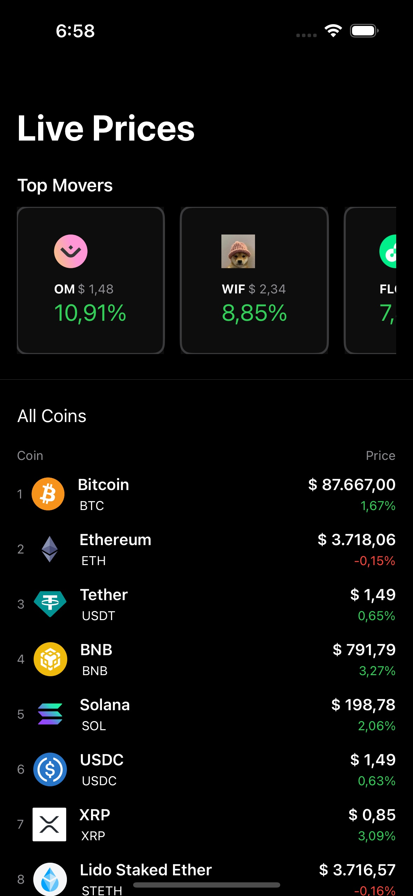
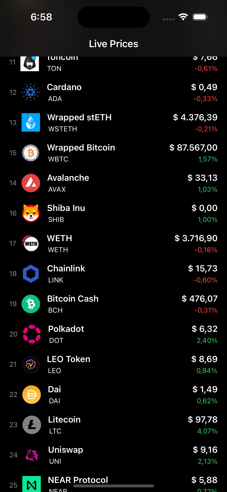
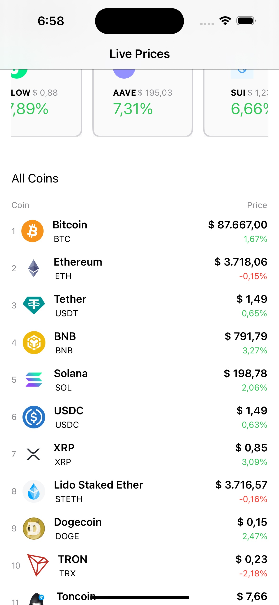

[![Swift Version][swift-image]][swift-url]
[![License][license-image]][license-url]
[![PRs Welcome][pr-welcome-image]][pr-welcome-url]

# Table of Contents
1. [Description](#description)
2. [Getting started](#getting-started)
3. [Usage](#usage)
4. [Arhitecture](#arhitecture)
5. [Structure](#structure)
6. [Running the tests](#running-the-tests)
7. [Deployment](#deployment)
8. [Dependencies](#dependencies)
9. [Workflow](#workflow)
10. [Contribute](#Contribute)
11. [Meta](#Meta)

# Cryptodemo

<p align="center">
  <a href="https://github.com/marcelomogrovejo/cryptodemo">
    
  </a>
  <p align="center">
    A simple project that shows cryptocurrencies and their markets
  </p>
</p>
</ br>

<p align="center">
    &nbsp;
    &nbsp;
    
</p>

# Description
<p>CryptoDemo project is a very simple app which is developed to learn how to implement a Cryptocurrency mobile app developed in SwiftUI.<br>
The project consists of a simple list of cryptocurrencies which the user can analyse their prices and tendencies. The information is fetched from an api service.</p>

# Getting started
1. Make sure you have the Xcode version 14.0 or above installed on your computer.<br>
2. Download the CryptoDemo project files from the repository.<br>
3. Open the project files in Xcode.<br>
4. Make sure the <strong>CryptoRepo</strong> and <strong>Kingfisher</strong> packages are downloaded successfully.<br>
5. Run the active scheme.<br>

You should see a list of top 5 cryptocurrencies on top in a horizontal scroll.<br>
And a second list of cryptocurrencies underneath.<br>

# Usage
In order to start analysing the cryptocurrencies, you should just start the app.<br>
🚧 This app is underconstuction 🚧

# Architecture
* CryptoDemo project is implemented using the <strong>Model-View-ViewModel (MVVM)</strong> architecture pattern.

* Model has any necessary data structure needed to generate a coin.
* ViewModel is bridge between the Model and the View. It provides data and behavior to the View, allowing it to bind directly to the ViewModel properties and commands.
* View is responsible for displaying the user interface to the end user. It receives input from the user and presents the data provided by the ViewModel.
* Project implements a remote repository package which fetch the data from an external api.<br><br>

# Structure
<p>🚧 In construction 🚧</p> 
* "Extension": Utils that can be used to fromatting data on the different Views among others.
* "ViewModel": View logic that handled user data and refresh user interface.
* "View": User interfaces like main view.
* "Model": Entities needed by the app like expenses.

# Running the tests
<p>🚧 In construction 🚧</p>
<p>The CryptoDemo project can be tested using the built-in framework XCTest.<br>
To start testing the project, you will need to change to the 'CryptoDemoTests' target in your Xcode project, and then just run the tests project.</p>

# Deployment
<p>Keep in mind that deploying an iOS app to the App Store requires having an Apple Developer account.</p>
1. Click on the "Product" menu in Xcode and select "Archive." This will create an archive of your project.
2. Once the archive has been created, select it in the Organizer window and click on the "Validate" button to perform some preliminary tests on the app.
3. Once validation is complete, click on the "Distribute" button and select "Ad Hoc" or "App Store" distribution. 
This will create a signed IPA file that can be installed on iOS devices.
4. Follow the prompts in the distribution wizard to complete the distribution process.
5. Once the distribution is complete, you can use the IPA file to install the app on iOS devices

# Dependencies
[Swift Package Manager (SPM)](https://www.swift.org/documentation/package-manager/) is used as a dependency manager.
List of dependencies: 
* [CryptoRepo package](https://github.com/marcelomogrovejo/cryptorepopackage) -> It contains the api calls needed to populate the user interfaces.
* [Kingfisher package](https://github.com/onevcat/Kingfisher/) -> It is a powerful, pure-Swift library for downloading and caching images from the web.

# Workflow
* Reporting bugs: <br> 
If you come across any issues while using the SwiftDataExmpl app, please report them by creating a new issue on the GitHub repository.

* Reporting bugs form: <br> 
```
App version: 1.02
iOS version: 16.1
Description: When I scroll the list of cryptocurrencies, the current prices are not showed in the correct format.
Steps to reproduce: Run the app, on the main list, observe the current prices of each cryptocurrency is showed in Hong Kong dollars instead of the locale currency.
```
* Submitting pull requests: <br> 
If you have a bug fix or a new feature you'd like to add, please submit a pull request. Before submitting a pull request, 
please make sure that your changes are well-tested and that your code adheres to the Swift style guide.

* Improving documentation: <br> 
If you notice any errors or areas of improvement in the documentation, feel free to submit a pull request with your changes.

* Providing feedback:<br> 
If you have any feedback or suggestions for the SwiftDataExmpl project, please let us know by creating a new issue or by sending an email to the project maintainer.

## Contribute
We would love you for the contribution to **CryptoDemo**, check the ``LICENSE`` file for more info.

## Meta
Marcel Mogrovejo – [Porfolio](https://marcelomogrovejo.gitlab.io/my-ios-portfolio/) – marcelo.mogrovejo@gmail.com

Distributed under the MIT license. See ``LICENSE`` for more information.

[https://github.com/marcelomogrovejo/](https://github.com/marcelomogrovejo/)


[swift-image]:https://img.shields.io/badge/swift-5.0-orange.svg
[swift-url]: https://swift.org/
[license-image]: https://img.shields.io/badge/License-MIT-blue.svg
[license-url]: LICENSE.md
[codebeat-image]: https://codebeat.co/badges/c19b47ea-2f9d-45df-8458-b2d952fe9dad
[codebeat-url]: https://codebeat.co/projects/github-com-vsouza-awesomeios-com
[pr-welcome-image]: https://img.shields.io/badge/PRs-welcome-brightgreen.svg?style=flat-square
[pr-welcome-url]: http://makeapullrequest.com
